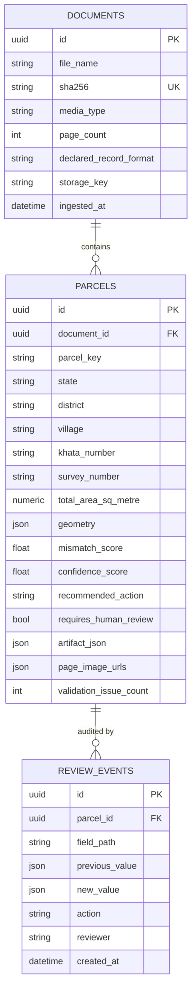
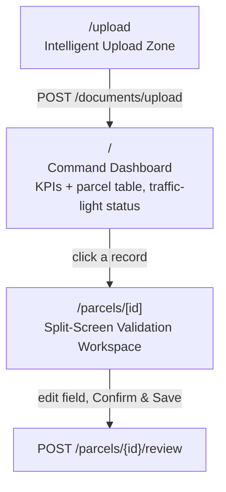

# Adhikar — System Architecture

**Smart India Hackathon — Problem Statement SIH26018 (Ministry of Rural Development)**

> Adhikar (अधिकार = "right / entitlement") is an intelligent system for digitizing and validating Indian land records — Jamabandi registers, Maharashtra 7/12 (Satbara) extracts, Khasra Girdawari, and generic Records of Rights — using OCR + Vision-LLM extraction, deterministic rule-based validation, and geospatial cross-referencing against cadastral maps.

---

## 1. The Problem

Indian land records exist mostly as **scanned paper documents**:

- Vernacular text (Devanagari and other scripts) mixed with numerals and stamps
- Inconsistent area units by region (bigha, guntha, kanal, marla, acre, hectare — each with different conversion factors)
- No automated arithmetic or cross-checking — errors and fraud go undetected
- Thousands of records, too few reviewers to manually verify each one

**Who feels this pain:** government land-record officials (e.g., a Tehsildar) who must triage huge volumes of digitized records and can only spend time where it matters.

**What Adhikar does about it:**

1. **Extracts** structured fields from scanned records using OCR + a Vision LLM
2. **Normalizes** them deterministically (numerals, units, vernacular vocabulary) — never left to LLM "guessing"
3. **Validates** with 22 rule-based checks (area sums, ownership shares, mutation chains, encumbrances)
4. **Cross-references** the extracted area against real cadastral polygon geometry to compute a **Mismatch score** and **Confidence score**
5. **Recommends an action**: auto-approve · send to review queue · field verification · reject & re-scan

A hard data-governance rule is enforced at the schema level (not a filter): **Aadhaar, mobile, and bank-account numbers are never extracted or stored.**

---

## 2. High-Level Architecture

Three independently deployable pieces, one integration seam:

```mermaid
flowchart TB
    subgraph Client["Browser"]
        FE["Next.js Frontend (:3000)\nReviewer Console"]
    end

    subgraph Server["FastAPI Backend (:8000)"]
        API["REST API\n/api/v1/*"]
        ING["Ingestion Service\n(the ONE integration seam)"]
        DB[("SQLite (dev) /\nPostgreSQL (prod)")]
        FILES[("Local disk\nbackend/data/uploads/")]
    end

    subgraph Engine["ai-engine (\"adhikar\" package)\nrunning IN-PROCESS, not a microservice"]
        PIPE["process_document()\nOCR → Table Layout → Vision LLM →\nNormalize → Validate → Discrepancy"]
    end

    subgraph External["External Vision-LLM APIs"]
        GROQ["Groq API\n(default, zero-cost path)"]
        ANTH["Anthropic API\n(higher accuracy, opt-in)"]
    end

    FE -- "fetch() REST calls" --> API
    API --> ING
    ING -- "in-process Python call\nfrom adhikar.pipeline import process_document" --> PIPE
    PIPE -- "network call" --> GROQ
    PIPE -. "network call (optional)" .-> ANTH
    ING --> DB
    ING --> FILES
    API -- "serves /static/uploads/*" --> FE
```

**Key fact for the slide:** the ai-engine is **not** a microservice. It's installed as an editable local Python package (`pip install -e ../ai-engine`) and called as a direct in-process function (`process_document(...)`) from `backend/app/services/ingestion.py`. There is no HTTP hop, no queue, no subprocess between backend and ai-engine.

---

## 3. The Extraction Pipeline (ai-engine)

Fixed, deterministic stage order — extraction always happens before validation, and validation never feeds back into extraction (keeps it a trustworthy check, not self-fulfilling):

```mermaid
flowchart LR
    A["Load Document\n(PDF/image)"] --> B["Preprocess\ndeskew, denoise,\nadaptive threshold"]
    B --> C["OCR Ensemble\nEasyOCR + Tesseract\n(hi/en, IoU-merged)"]
    C --> D["Table Layout\nruled-line grid detection"]
    D --> E["Vision LLM Extraction\nGroq or Anthropic\n(sees image + OCR text layer)"]
    E --> F["Normalize & Map\nnumerals, units, vernacular vocab\n→ domain model"]
    F --> G["Bounding-Box Attribution\nfuzzy-match text back to\nOCR line boxes"]
    G --> H["Validate\n22 rule-based checks\n(YAML policy)"]
    H --> I["Discrepancy Engine\ngeodesic area vs. cadastral polygon\n→ Mismatch + Confidence score"]
    I --> J["ExtractionArtifact\n(structured, auditable output)"]
```



### Why OCR runs before the LLM
The OCR ensemble's text is rendered and appended to the Vision LLM's prompt alongside the image itself. The model cross-checks its own visual reading against an independent OCR pass — this materially improves accuracy on faint or low-contrast scans.

### Provider abstraction (Groq vs. Anthropic)
| | Groq (default) | Anthropic (opt-in) |
|---|---|---|
| Cost | Zero-cost path | Higher cost |
| Mechanism | JSON mode + validate-and-repair retry loop (up to 2 repairs) | Strict tool-use → schema-valid by construction |
| Caching | None (no equivalent primitive) | Prompt caching enabled |
| Best for | Default / high-volume | Dense multilingual tables needing max accuracy |

Both implement one shared `VisionExtractorProtocol` — `pipeline.py` never imports a provider directly; `llm/factory.py` picks one from config (`ADHIKAR_LLM_PROVIDER`).

### Bounding-box attribution (new component)
The Vision LLM only transcribes text — it never reports pixel coordinates. `bbox_attribution.py` recovers approximate bounding boxes **after the fact** by fuzzy-matching (RapidFuzz, threshold 72%) each extracted field's raw text against the OCR ensemble's own line boxes. Below threshold → bbox left unset. Deliberately conservative: *a missing highlight is honest; a wrong one actively misdirects a reviewer.* Currently covers **owner name** and **total area** — this is what powers the click-to-highlight feature in the Document Viewer.

### Validation & Discrepancy scoring
- **22 rule-based checks** (`validation/rules.py`), policy-driven via YAML — arithmetic (area sums), ownership-share consistency, mutation-chain integrity, encumbrance checks.
- **Discrepancy engine** (`geo/discrepancy.py`): computes true geodesic area (via `pyproj`, WGS84 ellipsoid — not flat-plane math, which the codebase notes is wrong by ~6% at 20°N) from the cadastral polygon, compares it to the extracted textual area, and checks topology (overlaps/gaps with neighboring parcels).
  - **Mismatch score** (0–100, lower is better)
  - **Confidence score** (0–1, weighted blend of OCR/LLM/structural/geometric signals; capped at 0.55 if no geometry is matched)
  - **Recommended action**: `auto_approve` / `review_queue` / `field_verification` / `reject_re_scan`

---

## 4. Backend: API & Data Model

### REST API (`/api/v1`)

| Method | Path | Purpose |
|---|---|---|
| `POST` | `/documents/upload` | Upload a scan (multipart), runs the full pipeline synchronously, returns document + parcels |
| `GET` | `/parcels` | List/filter parcels (`state`, `district`, `village`, `requires_review`, `min_mismatch`, pagination) |
| `GET` | `/parcels/{id}` | Full parcel detail (artifact, geometry, provenance) |
| `POST` | `/parcels/{id}/review` | Submit a field correction → recorded as an immutable audit event |
| `GET` | `/health` | Liveness check |
| `GET` | `/metrics` | Prometheus metrics |

### Data model (ER diagram)



**Design notes worth mentioning in the talk:**
- `artifact_json` on `parcels` holds the **full** extracted record + per-field provenance + validation issues — a complete audit trail, not just the queryable columns.
- `geometry` is stored as plain JSON (GeoJSON), not a PostGIS `Geography` column — no spatial SQL is run against it; the geodesic math already happened inside the ai-engine.
- `review_events` is **append-only** — corrections are recorded, never overwrite `artifact_json` in place (re-applying corrections is a deliberate "next step," not yet built).
- Same schema runs unmodified on **SQLite** (zero-setup local dev) and **PostgreSQL** (production).

---

## 5. Frontend: Reviewer Console



**`/upload`** — drag-and-drop a scan; kicks off the real upload alongside a simulated 4-stage pipeline animation (Enhancing → OCR → Extracting → Ready) so the demo looks good even if the backend is slow/offline.

**`/` (Dashboard)** — KPI cards (Processing Volume, AI Accuracy, Auto-Validated, Flagged) + a searchable/filterable parcel table with red/amber/green traffic-light status.

**`/parcels/[id]` (Validation Workspace)** — the core reviewer screen:
- Mismatch & Confidence **gauges**
- Split screen: scanned **document image** (with click-to-highlight bounding boxes) ↔ **editable extracted-data form**
- **GIS discrepancy map** (MapLibre GL): cadastral polygon colored by mismatch severity (green/amber/red), neighboring parcels for context
- Scrollable **validation findings** list (severity, rule code, message, remediation)

**Resilience design choice:** if the backend is unreachable, read paths (`listParcels`, `getParcel`) transparently fall back to bundled demo fixtures — with a visible "Demo data" badge, never presented as real. Write paths (submitting a correction) **never** fall back; they fail loudly instead.

---

## 6. Tech Stack

| Layer | Technology |
|---|---|
| ai-engine | Python, Pydantic v2, OpenCV, EasyOCR + Tesseract, pypdfium2, Shapely/pyproj, Groq SDK, Anthropic SDK, Typer CLI |
| Backend | FastAPI, SQLAlchemy 2.0, Alembic, SQLite/PostgreSQL, Prometheus instrumentation |
| Frontend | Next.js 15 (App Router), React 19, TypeScript, Tailwind CSS, MapLibre GL |
| Infra (planned) | Docker Compose — Postgres/PostGIS, Redis, MinIO |

---

## 7. Current Limitations (be upfront about these in Q&A)

- **No async worker wired up yet** — Celery/Redis are dependencies but upload is fully synchronous today.
- **No object storage wired up yet** — files are written to local disk, not S3/MinIO.
- **No cadastral geometry source configured** in the reference deployment — real uploads always get `geometry = None`, so the discrepancy engine doesn't run end-to-end on live uploads yet (it does work via the CLI with `--geometry <geojson>`).
- **No authentication** — JWT settings exist but no login flow is wired up; reviewer identity is a plain query parameter today.
- **Bounding-box coverage is partial** — only owner name and total area currently get real highlight boxes; other fields use a simulated layout in the demo UI.
- **Corrections aren't re-applied** — a submitted correction is recorded as an audit event but doesn't yet update `artifact_json` or re-trigger validation.

These are natural "what's next" talking points for a roadmap slide.

---

## 8. Suggested Slide Breakdown

1. **Title** — Adhikar: Intelligent Land Record Digitization (SIH26018)
2. **Problem** — Section 1
3. **Solution overview** — one sentence per pipeline stage
4. **System architecture** — diagram from Section 2
5. **Extraction pipeline deep-dive** — diagram from Section 3
6. **Validation & Discrepancy scoring** — the 22 rules + geodesic cross-check + mismatch/confidence scores
7. **Data model** — ER diagram from Section 4 (keep it simple — just the 3 tables and what each stores)
8. **Reviewer console (demo screenshots)** — walk through Upload → Dashboard → Validation Workspace
9. **Tech stack**
10. **Roadmap / limitations** — Section 7, framed as "next steps"
