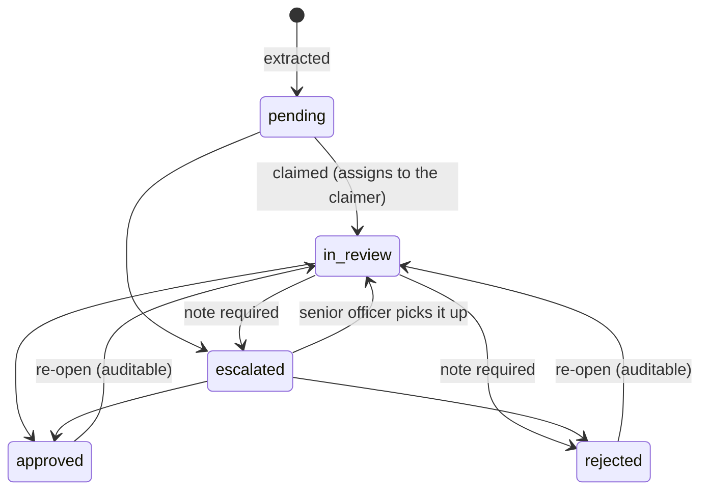
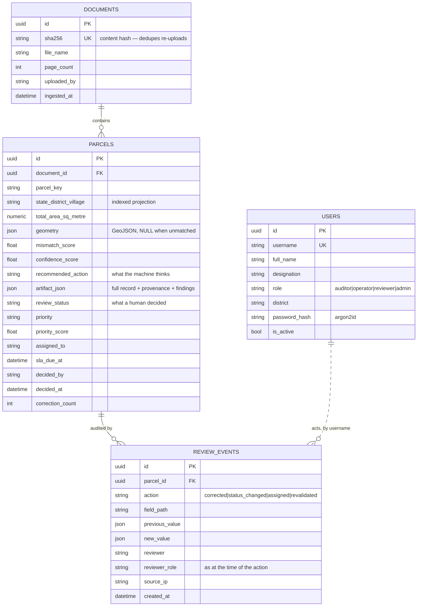
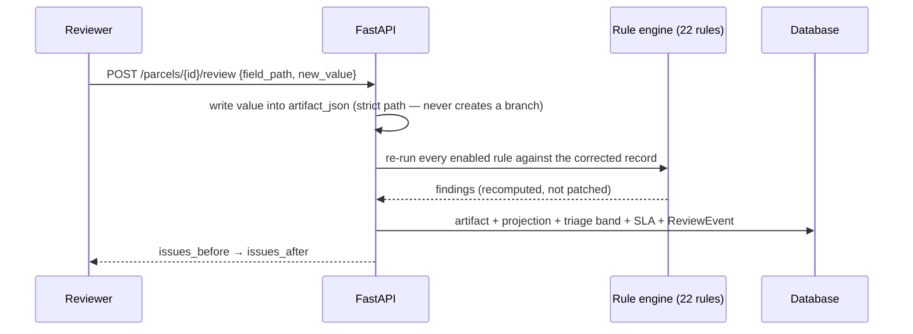
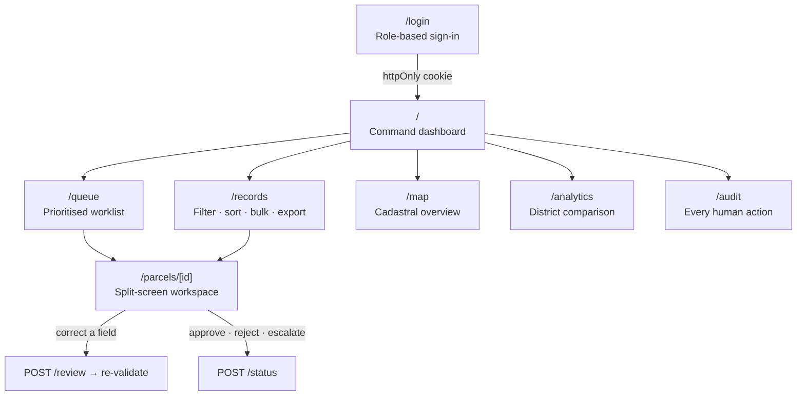

# Adhikar — System Architecture

**Smart India Hackathon — Problem Statement SIH26018 (Ministry of Rural Development)**

> Adhikar (अधिकार = "right / entitlement") is an intelligent system for digitizing and validating Indian land records — Jamabandi registers, Maharashtra 7/12 (Satbara) extracts, Khasra Girdawari, and generic Records of Rights — using OCR + Vision-LLM extraction, deterministic rule-based validation, and geospatial cross-referencing against cadastral maps.

---

## 1. The Problem

Indian land records exist mostly as **scanned paper documents**:

- Vernacular text (Devanagari and other scripts) mixed with numerals and stamps
- Inconsistent area units by region (bigha, guntha, kanal, marla, acre, hectare — each with different conversion factors)
- No automated arithmetic or cross-checking — errors and fraud go undetected
- Thousands of records, too few reviewers to manually verify each one

**Who feels this pain:** government land-record officials (e.g., a Tehsildar) who must triage huge volumes of digitized records and can only spend time where it matters.

**What Adhikar does about it:**

1. **Extracts** structured fields from scanned records using OCR + a Vision LLM
2. **Normalizes** them deterministically (numerals, units, vernacular vocabulary) — never left to LLM "guessing"
3. **Validates** with 22 rule-based checks (area sums, ownership shares, mutation chains, encumbrances)
4. **Cross-references** the extracted area against real cadastral polygon geometry to compute a **Mismatch score** and **Confidence score**
5. **Recommends an action**: auto-approve · send to review queue · field verification · reject & re-scan

A hard data-governance rule is enforced at the schema level (not a filter): **Aadhaar, mobile, and bank-account numbers are never extracted or stored.**

---

## 2. High-Level Architecture

Three independently deployable pieces, one integration seam:

```mermaid
flowchart TB
    subgraph Client["Browser"]
        FE["Next.js Frontend (:3000)\nReviewer Console"]
        SESS["Session route handlers · httpOnly cookie holds the JWT"]
    end

    subgraph Server["FastAPI Backend (:8000)"]
        API["REST API\n/api/v1/*"]
        ING["Ingestion Service\n(the ONE integration seam)"]
        DB[("SQLite (dev) /\nPostgreSQL (prod)")]
        FILES[("Local disk\nbackend/data/uploads/")]
    end

    subgraph Engine["ai-engine (\"adhikar\" package)\nrunning IN-PROCESS, not a microservice"]
        PIPE["process_document()\nOCR → Table Layout → Vision LLM →\nNormalize → Validate → Discrepancy"]
    end

    subgraph External["External Vision-LLM APIs"]
        GROQ["Groq API\n(default, zero-cost path)"]
        ANTH["Anthropic API\n(higher accuracy, opt-in)"]
    end

    FE -- "server components: read with the cookie" --> API
    FE -- "client components" --> SESS
    SESS -- "re-issue with Authorization: Bearer" --> API
    API --> ING
    ING -- "in-process Python call\nfrom adhikar.pipeline import process_document" --> PIPE
    PIPE -- "network call" --> GROQ
    PIPE -. "network call (optional)" .-> ANTH
    ING --> DB
    ING --> FILES
    API -- "serves /static/uploads/*" --> FE
```

**Key fact for the slide:** the ai-engine is **not** a microservice. It's installed as an editable local Python package (`pip install -e ../ai-engine`) and called as a direct in-process function (`process_document(...)`) from `backend/app/services/ingestion.py`. There is no HTTP hop, no queue, no subprocess between backend and ai-engine.

---

## 3. The Extraction Pipeline (ai-engine)

Fixed, deterministic stage order — extraction always happens before validation, and validation never feeds back into extraction (keeps it a trustworthy check, not self-fulfilling):

```mermaid
flowchart LR
    A["Load Document\n(PDF/image)"] --> B["Preprocess\ndeskew, denoise,\nadaptive threshold"]
    B --> C["OCR Ensemble\nEasyOCR + Tesseract\n(hi/en, IoU-merged)"]
    C --> D["Table Layout\nruled-line grid detection"]
    D --> E["Vision LLM Extraction\nGroq or Anthropic\n(sees image + OCR text layer)"]
    E --> F["Normalize & Map\nnumerals, units, vernacular vocab\n→ domain model"]
    F --> G["Bounding-Box Attribution\nfuzzy-match text back to\nOCR line boxes"]
    G --> H["Validate\n22 rule-based checks\n(YAML policy)"]
    H --> I["Discrepancy Engine\ngeodesic area vs. cadastral polygon\n→ Mismatch + Confidence score"]
    I --> J["ExtractionArtifact\n(structured, auditable output)"]
```



### Why OCR runs before the LLM
The OCR ensemble's text is rendered and appended to the Vision LLM's prompt alongside the image itself. The model cross-checks its own visual reading against an independent OCR pass — this materially improves accuracy on faint or low-contrast scans.

### Provider abstraction (Groq vs. Anthropic)
| | Groq (default) | Anthropic (opt-in) |
|---|---|---|
| Cost | Zero-cost path | Higher cost |
| Mechanism | JSON mode + validate-and-repair retry loop (up to 2 repairs) | Strict tool-use → schema-valid by construction |
| Caching | None (no equivalent primitive) | Prompt caching enabled |
| Best for | Default / high-volume | Dense multilingual tables needing max accuracy |

Both implement one shared `VisionExtractorProtocol` — `pipeline.py` never imports a provider directly; `llm/factory.py` picks one from config (`ADHIKAR_LLM_PROVIDER`).

### Bounding-box attribution (new component)
The Vision LLM only transcribes text — it never reports pixel coordinates. `bbox_attribution.py` recovers approximate bounding boxes **after the fact** by fuzzy-matching (RapidFuzz, threshold 72%) each extracted field's raw text against the OCR ensemble's own line boxes. Below threshold → bbox left unset. Deliberately conservative: *a missing highlight is honest; a wrong one actively misdirects a reviewer.* Currently covers **owner name** and **total area** — this is what powers the click-to-highlight feature in the Document Viewer.

### Validation & Discrepancy scoring
- **22 rule-based checks** (`validation/rules.py`), policy-driven via YAML — arithmetic (area sums), ownership-share consistency, mutation-chain integrity, encumbrance checks.
- **Discrepancy engine** (`geo/discrepancy.py`): computes true geodesic area (via `pyproj`, WGS84 ellipsoid — not flat-plane math, which the codebase notes is wrong by ~6% at 20°N) from the cadastral polygon, compares it to the extracted textual area, and checks topology (overlaps/gaps with neighboring parcels).
  - **Mismatch score** (0–100, lower is better)
  - **Confidence score** (0–1, weighted blend of OCR/LLM/structural/geometric signals; capped at 0.55 if no geometry is matched)
  - **Recommended action**: `auto_approve` / `review_queue` / `field_verification` / `reject_re_scan`

---

## 4. Backend: API, Workflow & Data Model

### REST API (`/api/v1`)

Every route except `/health`, `/auth/login`, `/auth/roles` and the OpenAPI docs
requires a bearer token. Role gates are enforced by one dependency
(`app.api.deps.require_role`), so there is exactly one place to audit for
"can this endpoint be reached without a token?".

| Method | Path | Min. role | Purpose |
|---|---|---|---|
| `POST` | `/auth/login` | — | Exchange credentials for a JWT |
| `GET` | `/auth/me` · `/auth/roles` | any · — | Signed-in profile; the role vocabulary |
| `POST`/`GET` | `/auth/users` · `/auth/users/{id}/deactivate` | admin | Account management (suspend, never delete) |
| `POST` | `/documents/upload` · `/documents/batch-upload` | operator | Ingest one scan, or a folder. Deduplicated by SHA-256 |
| `GET`/`DELETE` | `/documents` · `/documents/{id}` | operator · admin | The document register |
| `GET` | `/parcels` | any | Paged, filtered, sorted list. Returns `{items, total, limit, offset}` |
| `GET` | `/parcels/queue` | any | The prioritised worklist (`scope=mine\|unassigned\|district\|all`) |
| `GET` | `/parcels/facets` · `/parcels/geojson` | any | Filter tree; RFC 7946 FeatureCollection for the map |
| `GET` | `/parcels/{id}` · `/parcels/{id}/events` | any | Full detail (artifact, geometry, provenance, triage reasons); its audit trail |
| `POST` | `/parcels/{id}/review` | operator | Apply a correction **and re-run the rule engine** |
| `POST` | `/parcels/{id}/revalidate` | operator | Re-judge under the current policy without re-running OCR |
| `POST` | `/parcels/{id}/status` · `/assign` · `/bulk/status` | reviewer | Adjudicate, assign, decide in bulk |
| `DELETE` | `/parcels/{id}` | admin | The only destructive route |
| `GET` | `/audit/events` | any | Department-wide trail (this is why `auditor` exists) |
| `POST` | `/succession/validate` | operator | Assess (and, by default, file) an ownership-succession document bundle |
| `GET` | `/succession/cases` · `/cases/{id}` | any | The succession queue; one case in full (bundle read, every check, risk arithmetic, timeline) |
| `POST` | `/succession/cases/{id}/revalidate` | operator | Re-judge a filed case under the current policy, without re-reading its documents |
| `GET` | `/succession/cases/{id}/events` · `/history` | any | One case's ownership chain; a parcel's chain across every case ever filed |
| `GET` | `/succession/cases/{id}/explain` · `/summary` | any | The risk score's per-check arithmetic; counts by outcome and risk band |
| `DELETE` | `/succession/cases/{id}` | admin | Remove a case filed in error, and its derived chain |
| `GET` | `/analytics/*` | any | `summary`, `districts`, `timeseries`, `rules`, `throughput`, `queue-health` |
| `GET` | `/exports/*` | any | `parcels.csv`, `audit.csv`, per-parcel `artifact.json` and `report.html` |
| `GET` | `/system/rules` · `/policy` · `/status` | any | Live rule catalogue, active tolerances, runtime status |
| `GET` | `/health` · `/metrics` | — | Liveness/readiness; Prometheus |

### The adjudication workflow



Transitions not on this diagram are refused with a `409`, never silently ignored —
an audit trail that records impossible transitions is worse than useless. Approved
cannot go straight to rejected: the reversal itself has to be auditable, so it goes
back through review.

**Triage.** `app.services.triage.assess_priority` turns the pipeline's scores into a
0–100 score, a band, and *the reasons*:

| Signal | Weight | Why it ranks where it does |
|---|---|---|
| Cadastral mismatch | 34 | Implies a dispute on the ground |
| Worst finding severity | 30 | The record contradicts itself |
| Extraction confidence | 22 | Implies a better scan is needed, not a field visit |
| Finding volume | 8 | Saturates at five — nine vs twelve says nothing |
| Pipeline recommendation | 6 | What the discrepancy engine itself concluded |

Bands are cut so a single maximal signal reaches HIGH, while CRITICAL requires two
independent systems to agree — the standard a record should meet before jumping a
queue. A missing mismatch score contributes **zero**, not a penalty: absence of
evidence is not evidence of a problem, and penalising it would pin every
geometry-less record to the top of every queue forever.

### Data model



**Design notes worth mentioning in the talk:**

- `recommended_action` and `review_status` live side by side on purpose. The first is
  what the machine concluded, the second what an officer decided — keeping them
  separate makes *"the model said auto-approve and the Tehsildar disagreed"* a
  queryable fact rather than a lost one.
- `reviewer_role` is denormalized onto each event. An audit trail that re-read the
  user's *current* role would silently rewrite history the moment somebody is promoted.
- Users are **deactivated, never deleted** — events reference reviewers by username,
  and deleting the row would orphan every decision that person made. A suspended
  token stops working on the next request, not at its expiry, because
  `is_active` is the one thing still re-read per request.
- `sla_due_at` is stored rather than computed on read, so "overdue" is a plain indexed
  comparison in SQL instead of a per-row calculation the database cannot filter on.
- `geometry` uses `none_as_null=True`. By default SQLAlchemy stores a Python `None` in
  a JSON column as the JSON value `null`, which is *not* SQL NULL — every
  `geometry IS NOT NULL` filter would then match every row, and the map would draw
  invisible features for parcels with no matched polygon.
- Same schema runs unmodified on **SQLite** (zero-setup) and **PostgreSQL**.

### The correction loop (the thing that makes this a workflow)



A path that does not resolve is rejected rather than materialised: auto-creating a
missing `owners[3]` would let a typo invent a fourth owner on a land record.

---

## 5. Frontend: Reviewer Console



**Session handling.** `/api/session` (a Next route handler) exchanges credentials with
the API server-side and stores the JWT in an **httpOnly** cookie; the browser bundle
never sees it. Client components call a same-origin proxy (`/api/proxy/...`) which
re-attaches it. A second, readable cookie carries display identity only — name, role,
district — so the UI can grey out actions the role cannot perform. That is
presentation, never authorization: every gate it drives is enforced independently by
the API.

**Failures are values, not exceptions.** Every server-side reader returns
`{ data } | { error }`, so a dashboard assembled from six independent queries degrades
one panel when one query fails instead of blanking the page — and distinguishes "the
API refused this" from "the API is not running", which need different actions from
whoever is reading.

**Filters live in the URL.** A filtered records view is a link a Tehsildar can paste
into an email, the back button behaves, and the CSV export is built from the *same*
query string as the table — an export covering a different set than the screen it was
launched from is the kind of discrepancy that discredits a whole report.

**Visualization.** Chart series use a fixed palette order validated for
colour-vision separation, never cycled past eight; status colours are a separate,
reserved set and always ship with an icon and a word. One y-axis, always — two
measures of different scale become two charts, never two scales on one plot.

---

## 6. Tech Stack

| Layer | Technology |
|---|---|
| ai-engine | Python, Pydantic v2, OpenCV, EasyOCR + Tesseract, pypdfium2, Shapely/pyproj, Groq SDK, Anthropic SDK, Typer CLI |
| Backend | FastAPI, SQLAlchemy 2.0, Alembic, PyJWT + Argon2 (passlib), structlog, SQLite/PostgreSQL, Prometheus instrumentation |
| Frontend | Next.js 15 (App Router), React 19, TypeScript, Tailwind CSS, MapLibre GL |
| Infra (optional) | Docker Compose — Postgres/PostGIS, Redis, MinIO |

**Tests:** 70 backend tests (`cd backend && pytest`) covering RBAC and the
separation of duties, the correction/re-validation loop, triage scoring, paging
totals, exports, the rule catalogue and the ownership-succession API (27 of the 70);
163 ai-engine tests (`cd ai-engine && pytest`) covering normalization, unit
conversion, validation rules, discrepancy scoring, and ownership-succession
validation — the ten S1–S10 checks, name/identifier matching, and risk scoring
(75 of the 163). `python scripts/seed_demo_data.py --verify` asserts that every
seeded record — and both seeded succession cases — still produce the finding they
were written to demonstrate.

---

## 7. Current Limitations (be upfront about these in Q&A)

- **No async worker wired up yet** — Celery/Redis are dependencies but upload is
  fully synchronous today. The batch endpoint commits per file so a long folder does
  not become one long transaction.
- **No object storage wired up yet** — files are written to local disk, not S3/MinIO.
- **No cadastral geometry source configured** in the reference deployment, so a *real
  upload* gets `geometry = None` and the discrepancy engine does not run end-to-end on
  it. It does work via the CLI with `--geometry <geojson>`, and the seeded corpus
  carries synthetic polygons so the map and mismatch scoring are demonstrable. The
  console reports unmatched records as a count rather than drawing empty features.
- **Bounding-box coverage is partial** — only owner name and total area currently get
  real highlight boxes. Fields without attribution draw *nothing*, rather than a
  plausible rectangle in roughly the right place, which a reviewer would trust.
- **Confidence and mismatch on seeded records are synthetic** — those come from OCR
  and geometry stages that cannot run offline. The *validation findings* on seeded
  records are genuine engine output over synthetic inputs, not fixtures.
- **Role changes take effect at next login** — the role is a token claim; only
  account existence and active status are re-read per request.
- **Name matching is approximate by construction.** Linking a death certificate to a
  recorded owner, or a mutation's transferee to a named heir, uses fuzzy string
  matching (worst-token-wins — see `adhikar.normalize.names`), reported with its
  score and flagged (`SUCCESSION_NAME_MATCH_APPROXIMATE`) whenever a chain rests on
  one. It is tuned against Indian naming patterns (shared family names, `s/o`/`d/o`
  qualifiers, honorifics) but is not infallible, and the report always says which
  links were exact and which were not.
- **A revenue year is not a date.** A Record of Rights dated only by revenue year
  (`"2025-26"`) is anchored to that year's start for chain ordering and its end for
  windowing a mutation into it, and reported as `date_stated: false` throughout — the
  console never draws an inferred position as if it were printed on the page.
- **The engine validates documents, not law.** It has no model of succession law and
  makes no entitlement determination; it reports what the submitted paperwork does
  and does not establish. Whether a document (a will, a court order) is itself valid,
  registered or current is outside what a document-consistency system can determine
  from images of the documents alone.

---

## 8. Suggested Slide Breakdown

1. **Title** — Adhikar: Intelligent Land Record Digitization (SIH26018)
2. **Problem** — Section 1
3. **Solution overview** — one sentence per pipeline stage
4. **System architecture** — diagram from Section 2
5. **Extraction pipeline deep-dive** — diagram from Section 3
6. **Validation & discrepancy scoring** — the 22 rules + geodesic cross-check
7. **The workflow** — state diagram + separation of duties + triage weights (Section 4)
8. **Data model** — ER diagram, focusing on *machine verdict vs human decision*
9. **Live demo** — sign in as `operator` (Approve is absent) → correct a field on the
   Raipur record → watch `IDENTIFIER_MISSING` clear → sign in as `tehsildar` → approve
   → open `/audit` and show both actions recorded with roles and before/after values
10. **Tech stack & tests**
11. **Roadmap / limitations** — Section 7, framed as "next steps"
